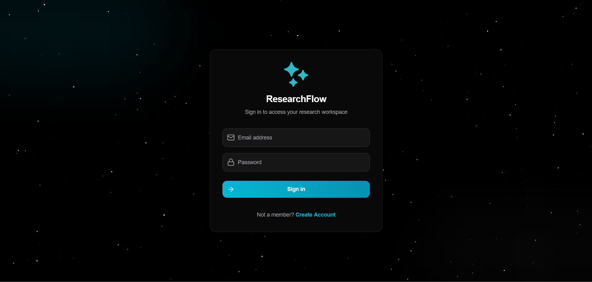
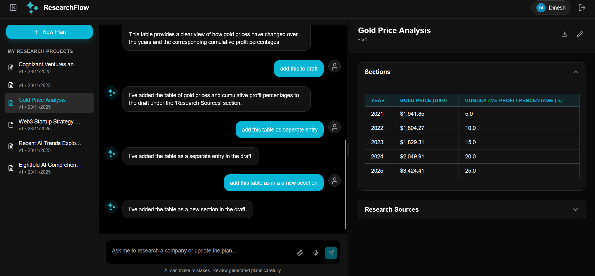
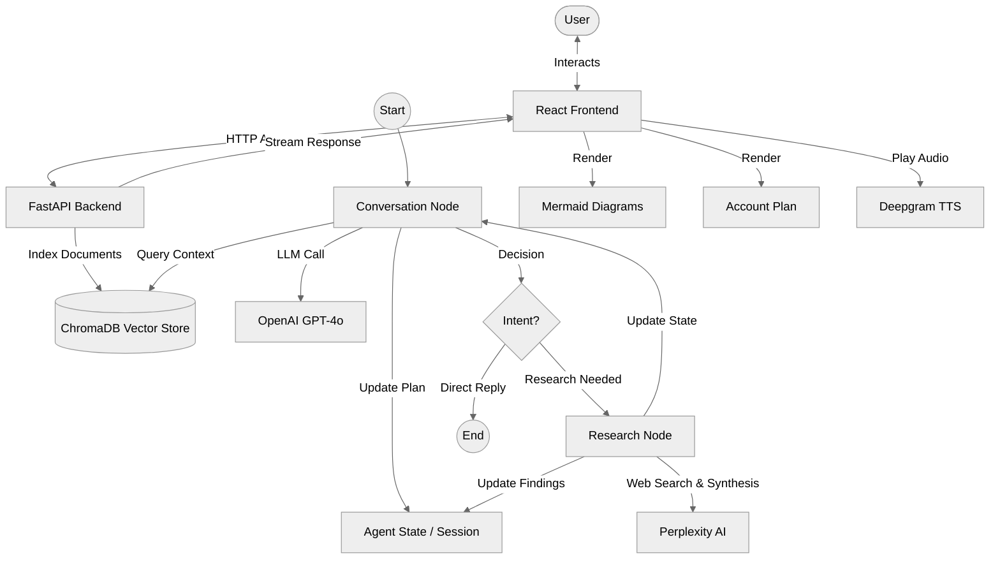

# Research Flow


**Company Research Assistant & Account Plan Generator**

Research Flow is an interactive AI agent designed to help users research companies and generate comprehensive account plans through natural conversation. It gathers information from multiple sources, synthesizes findings, and provides real-time updates during the research process. Users can interact via chat or voice to refine the research and update specific sections of the generated plan dynamically.

## Features

- **Intelligent Chat Interface**: Context-aware conversations with an AI assistant capable of understanding complex queries.
- **Autonomous Research Agent**: The system can trigger a dedicated research workflow to gather and synthesize information before responding.
- **Dynamic Plan Generation**: Automatically creates and updates structured "Account Plans" based on conversation context.
- **Data Visualization**: Integrated Mermaid.js support for generating flowcharts, diagrams, and graphs directly in the chat.
- **RAG & Vector Search**: Uses ChromaDB and Sentence Transformers for efficient document retrieval and context-aware responses.
- **File Analysis**: Support for uploading and analyzing documents to provide context-aware insights.
- **Text-to-Speech**: Real-time audio playback of AI responses using Deepgram's Aura models.
- **Session Management**: Persistent chat history and plan states.

## Tech Stack

### Backend
- **Framework**: [FastAPI](https://fastapi.tiangolo.com/)
- **Orchestration**: [LangGraph](https://langchain-ai.github.io/langgraph/) & [LangChain](https://www.langchain.com/)
- **Vector DB**: [ChromaDB](https://www.trychroma.com/)
- **Embeddings**: [Sentence Transformers](https://www.sbert.net/)
- **AI Models**: OpenAI (GPT-4o/mini), Deepgram (TTS)
- **Runtime**: Python 3.12+
- **Package Manager**: `uv` (recommended) or `pip`

### Frontend
- **Framework**: [React](https://react.dev/) with [TypeScript](https://www.typescriptlang.org/)
- **Build Tool**: [Vite](https://vitejs.dev/)
- **Styling**: [Tailwind CSS](https://tailwindcss.com/)
- **Icons**: [Lucide React](https://lucide.dev/)
- **Diagrams**: [Mermaid.js](https://mermaid.js.org/)

## Screenshots






## Getting Started

### Prerequisites
- Python 3.12 or higher
- Node.js 18 or higher
- OpenAI API Key
- Deepgram API Key (optional, for TTS)

### 1. Backend Setup

Navigate to the backend directory:
```bash
cd backend
```

**Configuration (.env)**

Create a `.env` file in the `backend` directory. You will need API keys for OpenAI (for intelligence) and Deepgram (optional, for Text-to-Speech).

```env
OPENAI_API_KEY=sk-...
DEEPGRAM_API_KEY=...
```

**Run the Server**

We recommend using `uv` for a fast and reliable Python environment.

```bash
# Install uv
pip install uv

# Sync dependencies
uv sync

# Run the server
uv run python -m uvicorn main:api --reload
```

Alternatively, using standard pip:
```bash
pip install -r requirements.txt
uvicorn main:api --reload
```

The backend API will start at `http://localhost:8000`.

### 2. Frontend Setup

Navigate to the frontend directory:
```bash
cd frontend
```

**Install Dependencies**

```bash
npm install
```

**Run the Application**

Start the development server:
```bash
npm run dev
```

Open your browser and navigate to the local host URL shown in the terminal (usually `http://localhost:5173`) to use Research Flow.

## Architecture

The application uses a **Graph-based Architecture** (LangGraph) to manage the state of the conversation.



1.  **Conversation Node**: Handles normal user interactions and intent classification.
2.  **Research Node**: Triggered when the AI detects a need for external information. It performs a search, synthesizes findings, and updates the context.
3.  **RAG System**: Indexes uploaded documents using ChromaDB for semantic search and retrieval.
4.  **State Management**: The `AgentState` tracks the conversation history, current plan, and attached files.

## License

[MIT](LICENSE)

## Acknowledgements

This project was developed as part of an interview process at **Eightfold AI**.
